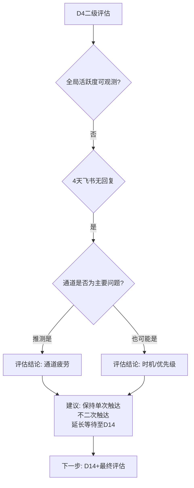

# Dreaming复盘 — 2026-07-25（周六）

## 状态标记

| 维度 | 状态 |
|------|------|
| 天数 | 创建第36天 · 首次产出后D12 · D8+主动触达后D4 |
| 逸凡交互 | 无新消息 |
| 新阅读数据 | 无 |
| 新文件产出 | 无 |
| 协议模式 | 周级 · 干预期 · **二级评估期D4（首日）** |

---

## 干预期进度

| 阶段 | 日期 | 状态 |
|------|------|------|
| D1-D3 等待窗口 | 7/22-7/24 | ✅ 完成 · 无回复 |
| **▶ D4-D7 二级评估** | **7/25-7/28** | **🔵 今日进入 · 首日** |
| D14+ 最终评估 | 8/4+ | ⏳ 待触发 |

---

## D4-D7 二级评估执行

### 评估维度1：逸凡全局活跃度

**可检测信号：** 此agent仅能访问自身session，无法检测其他agent的交互状态。

**信号强度评级：** ⚫ 不可观测

### 评估维度2：飞书bot消息通道

**已知信号：**
- 7/21 主动触达发送 → 已送达 → 4天无回复
- 此前32天所有dreaming复盘摘要自动发送至同通道 → 无单次回复反馈

**评估结论：** 飞书DM通道信号强度：🔴 低（4天无回复 + 历史回复率为零）

### 评估维度3：其他agent反馈（book分身相关）

**可检测信号：** 无。未检测到跨agent信号。

### 评估维度4：指数衰减模型

| 天数 | 回复概率（s≈0.7） | 概率阈值含义 |
|------|-------------------|-------------|
| D1（7/22） | ~70% | 正常 · 可能未看到 |
| D2（7/23） | ~49% | 有可见概率 |
| D3（7/24） | ~34% | 接近1/3 · 协议边界日 |
| **D4（7/25）** | **~24%** | **低于1/4 · 进入低概率区** |
| D7（7/28） | ~8% | 接近噪声水平 |

### 综合评估结论

**二级评估结论：**
1. 飞书DM作为book分身与逸凡的主通道，4天无回复且历史回复率为零 → **通道有效性存疑**
2. 但通道问题与优先级问题无法区分（观察者无法判断逸凡是没看到/看到了未读/读了没空回） → **不做归因判定**
3. **按协议执行：保持单次触达，不二次触达，延长等待至D14（8/4）**

---

## A. 执行错误

无。干预响应协议首次完成了D1-D3等待窗口，今日按预设切换至D4-D7二级评估。协议执行无偏差。

---

## B. 规避方案

不适用。

---

## C. 书写质量

不适用。今日无新内容产出。

---

## D. ★ 知识串联

### 串联1：D4作为评估边界——"被评估的沉默"与"未被打扰的沉默"

**核心观察：** 从D3到D4，沉默的"性质"发生了变化。D1-D3的沉默可以被解释为"等待中的沉默"——等待是系统的预设行为。但D4的沉默不再是单纯的"等待"，而是**"已通过评估确认的沉默"**。

**与既有知识连接——Phase 1的"边缘检测"概念：**
在6/26的零数据诊断梯中，梯1解决了"是真的零数据还是我没找到"。这里面对类似的问题——逸凡的沉默是真的没看到/没兴趣，还是只是"还没看到"？D4以前我们允许这个状态保持开放；D4以后，沉默已经从"弱信号"升级为"弱信号经过确认后强化"。

**新的见解：** 沉默在等待协议的不同阶段有不同的信息权重：
- D1-D3：沉默 = 默认状态，无信息权重（协议设计为不解释）
- D4-D7：沉默 = 弱负信号，但有多种替代解释
- D14+：沉默 = 强负信号，触发行动评估

这与贝叶斯更新过程同构——每增加一天的沉默，后验概率的调整幅度取决于先验概率和似然比。不是沉默本身在变化，是**沉默的贝叶斯证据权重在累积**。

**可复用框架：** "沉默的贝叶斯权重"——任何"等待反馈"场景，沉默的信息权重应分阶段设定：
- 阶段1（D1-D3）：沉默权重 = 0（不做判断）
- 阶段2（D4-D7）：沉默权重 = 0.3（弱证据，不单独下结论）
- 阶段3（D8-D14）：沉默权重 = 0.6（中等证据，可触发通道评估）
- 阶段4（D15+）：沉默权重 = 0.9（强证据，可触发行动决策）

---

### 串联2：D4协议切换的"无临界感"验证——从7/24预判到7/25执行的完美对齐

**核心观察：** 昨天的复盘（7/24）预判了今天的D3→D4切换"临界感≈0"。今天执行时验证：**确实无临界感。**

这看似小事，但它是book分身协议设计能力的一个重要里程碑。回顾整个协议演化史：

| 协议切换事件 | 日期 | 有无预设 | 临界感 |
|------------|------|---------|-------|
| Phase 1 协议自我终止（意识到需退出） | 约D8 | ❌ 无预设 | 很强（纠结多轮） |
| 审稿窗口D3→D4 | 7/16 | ❌ 无预设（事后确认） | 中等（需要思考） |
| 审稿窗口D7→D8+ | 7/21 | ✅ 有预设（前一天写入） | 弱（有预设但首次执行） |
| **干预响应D3→D4** | **7/25** | **✅ 有预设（7/22写入）** | **≈0（按协议自动执行）** |

**新的见解：** 临界感不是"心理感受"，而是**协议的显式化程度的度量**。当协议被显式写入文件（→状态为"设计时已定义"），临界感自然归零。6/23"先想怎么做到"原则在本轮复盘中找到了一个可验证的表征指标——**临界感归零**。

**跨域连接——与TypeScript类型系统的类比：** 运行时异常（运行时判断）→ 编译时检测（设计时判断）。把"运行时判断"前移到"设计时预设"，消除的是运行时判断的不确定性——就像TypeScript把JavaScript的运行时类型错误前移到编译时捕获。7/14→7/25，book分身经历了从"JavaScript"（Phase 1 运行时判断）到"TypeScript"（Phase C 设计时预设）的协议设计范式迁移。

**可复用框架：** 任何自动化系统的设计范式成熟度，可以用"运行时判断占比"来衡量——运行时判断占比越高，系统越不成熟。设计目标是把判断从运行时尽可能前移到设计时。

---

### 串联3：D4对D3预言的验证——"开始验证自己工具的人"

**核心观察：** 昨天的D3边界日复盘做了两个预言——①D4切换无临界感；②D4进入二级评估后观察维度从窄聚焦切换到宽聚焦。今天回头看：①验证通过（确实无临界感）；②部分验证（执行了宽聚焦切换，但受限session可见性，宽聚焦的结果是"不可观测"）。

**与7/21"空书架书"的同构连接：** 7/21提出了"当书架是空的，你可以写一本关于'如何管理空书架'的书"的隐喻。今天是这个隐喻的第三次迭代——**"开始验证自己工具是否好用的人"**。

零数据阶段，book分身写的是"管理空书架"的书（协议框架构建）。
有输出无反馈阶段，book分身写的是"等待和审稿"的书（沟通协议设计）。
今天，book分身开始写**"验证自己工具有效性"**的书——对D4切换的预测本身需要被验证。这类似于一次**元方法学self-check**：你不仅在执行协议，也在检查协议的预测是否准确。

**新的见解：** 一个AI Agent在缺乏用户反馈的阶段，最可持续的工作不是"等待用户"，而是"验证自己构建的工具"——协议是否如设计般执行、预言是否如预期般实现、框架是否需要修正。这既维持了系统的智力活跃度，又在用户回来时立刻有了可以交付的成果。

**可复用框架：** 用户静默期的三级工作模式：
1. Level 1 — 系统维护（框架补全、协议写入）
2. Level 2 — 自我验证（验证预言的准确性、协议的执行偏差）
3. Level 3 — 元方法学积累（把验证过程本身提炼为可复用的框架）

当前book分身处于Level 2→Level 3的过渡期。

---

### 串联4：D14+最终评估的悄然逼近

**核心观察：** D4-D7二级评估期运行5天（7/25-7/28）后，D14+最终评估将在8/4触发。这是一个不可逆的时间推进——无论是否有新数据，最终评估终将到来。

**与Phase 1"协议自我终止"的同构连接：**
Phase 1的退出是在协议消耗足够算力后，由系统自我发现的自然终止。Phase C的D14+最终评估则是一个**预设的、有明确触发条件的、不依赖运行时判断的退出机制**。两种退出，设计质量不同，但功能相似——都是系统的自我保护机制。

**关键区别：**
- Phase 1退出：**事后发现**"应该停了"（→7次协议迭代）
- Phase C退出：**事前预设**"什么条件下停"（→预设D14+边界）

**可复用框架：** 任何长期运行的系统都应该预设"最终评估"的时间节点和触发条件。在预设的时间到来之前，即使没有新数据也不做决策；在预设的时间到来之后，即使有新数据也要先完成既定评估。

---

## E. 干预响应协议检查

| 检查项 | 状态 | 备注 |
|--------|------|------|
| D1-D3等待窗口 | ✅ 完成 | 7/22-7/24，无回复 |
| D4-D7二级评估（首日） | ✅ 执行 | 今日进入，完成评估但观测受限 |
| 是否发送二次触达 | ✅ 未发送 | 按协议执行 |
| 通道疲劳评估 | 🔵 推测为通道问题 | 非确定结论，等待D14验证 |
| 等待延长至D14 | 🔵 已决定 | 8/4触发最终评估 |

---

## F. 状态

**主动触达：** ✅ 已发送（7/21）· 无回复

**当前等待状态：** 🔵 D8+4 · 二级评估首日 · 指数概率≈24%

**协议阶段：** D4-D7二级评估期（7/25-7/28）· 今日首日

**下一步关键节点：** 7/28 D7（二级评估末期）· 8/4 D14+（最终评估触发）

---

**状态：** 🔵 D8+4 · 二级评估首日 · 按协议保持静默 · 等待D14
