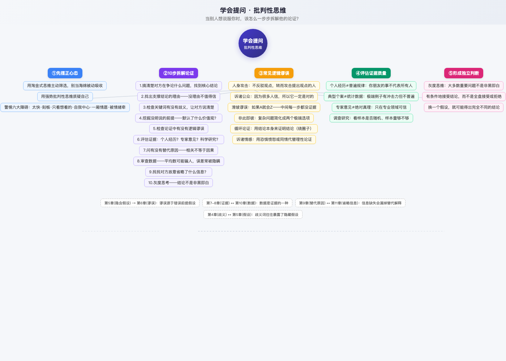

# 《学会提问（原书第12版）》深度读书笔记

**作者：** 尼尔·布朗（经济学教授）· 斯图尔特·基利（心理学教授）
**出版社：** 机械工业出版社
**评分：** 微信读书 8.36/10 · 4277人评分 · 846人在读
**字数：** 原书约25万字

---

## 附：思维导图

> 打开 `学会提问-思维导图-最终版.html` 可交互查看（滚轮缩放、拖拽平移）

---

## 一、这本书在讲什么

这本书讲的核心命题是：**你不会因为信息多而变聪明，你会因为会提问才变聪明。**

当今社会最大的问题不是信息太少，而是信息太多且互相矛盾。社交媒体的一篇推送说"糖有害健康"，另一篇说"糖的坏处被夸大了"；一个经济学家说加息好，另一个说加息是灾难。你靠什么来判断？这本书给的答案是一套系统性工具——10个问题，按顺序走一遍，你就可以自己判断一个论证到底值不值得信。

这本书跟市面上大多数"批判性思维"书籍的不同之处在于：它不教你"质疑一切"的态度，而是一步一步教你**怎么质疑**。态度可以空转，但流程不能。你按照它的10步流程走完，自然就做了批判性分析。

全书贯穿一条暗线：**批判性思维最难的不是学会技巧，而是学会接受自己可能是错的。** 大部分人学完后第一反应是拿起这套工具去挑别人的刺，但作者在一开头就预告了这一点——如果你只是在用批判性思维巩固自己的立场，你学废了。真正值钱的是发现自己错了几次，而不是发现别人错了几次。

---

## 二、前置心态：先摆正你的思维模式

### 海绵式思维 vs 淘金式思维

**海绵式思维**：被动吸收所有信息，读什么信什么。好处是积累知识快，坏处是读到最后读到什么就相信什么。

**淘金式思维**：主动与内容互动，边读边问"这个观点站得住吗？"。淘金式思维最重要的特点是互动式参与——作者和读者之间展开对话。一个会思考和判断的人愿意赞同别人的观点，但他首先得为自己的问题找到一些令人信服的答案。

全书最火的一段话：**"我们倾听他们，是为了构建出自己的答案，而不是听了他们的话以后，马上就按他们说的去做，好像自己是只无助的羔羊。"**

### 弱势批判性思维 vs 强势批判性思维

**弱势**：利用批判性思维捍卫自己当前的信念，目的是驳倒对方、捍卫自己。本质上是智力上的"护短"——你只是在找别人的漏洞来证明自己没错。

**强势**：利用批判性思维评价所有断言和信念，包括自己的。随时准备承认自己错了。

这个区分是全书最重要的概念之一。作者特意在一开头就强调它，因为他知道大部分人学完这本书后会做什么——拿起谬误清单去挑别人的刺。他不是在教你这个。他在教你：先质疑自己，再去质疑别人。

### 情感与理性

引用自乔纳森·海特的《象与骑象人》。作者把我们对情感的依赖描述为一头发怒的大象沿着乡间一路蹂躏肆虐，而我们的理智则如同一个弱小的骑手，竭尽全力想要控制住这头大象。

你以为在理性决策，很多时候是情感先做了决定，理性跳出来找个理由合理化它。

### 警惕六大障碍（第13章）

1. **思考太快**——系统1（直觉）替代系统2（分析）
2. **刻板印象**——用预设标签代替具体分析
3. **习惯性思维（确认偏误）**——只看自己想看的
4. **自我中心**——天然认为自己的观点更正确
5. **一厢情愿**——愿意相信让自己舒服的结论
6. **被情绪支配**——情感驱动，理性沦为事后合理化工具

---

## 三、核心框架：10步拆解论证流程

从"看到一段话"到"做出判断"的完整操作流水线。每一步配内部案例（书中原例）和外部案例（真实事件）。

---

### Step 1：搞清楚论题和结论

**含义**：先问自己——对方到底在争论什么？他想让我相信什么？

很多人的争论无效，因为他们争论的根本不是同一个问题。有人问"是否可行"（描述性论题），有人答"是否应该做"（规范性论题）。两种论题需要完全不同的证据。

**结论的5条线索**：
① 找指示词（因此、所以、由此可见、研究表明）
② 看文章开头和结尾
③ 问自己"他到底想让我信什么？"
④ 排除不是结论的部分
⑤ 注意语境和写作目的

**书中内部案例**：几个同事讨论了半天，才发现争论的根本不是同一个问题——一个在问"是否可行"，一个在回答"是否应该"。

---

### Step 2：找出支撑结论的理由

**含义**：论证 = 结论 + 理由。没有理由的结论只是断言，不值得认真对待。评价之前要先等一等——把对方的理由找全了再评估。

找理由的提示词：因为、由于、基于、出于这个原因。

**书中内部案例**：ETS研究表明，当学生在阅读中主动标记"理由"和"结论"时，理解能力比不做标记的学生高出30%以上。

**外部案例——SpaceX星舰审批争议（2024年）**

**SpaceX是什么**：马斯克创立的航天公司，全球最大的商业火箭发射服务商。星舰是其正在开发的重型运载火箭，目标是实现火星移民。

**发生了什么**：2024年，SpaceX高管多次公开声称星舰第五次试射延期是因为"FAA审批太慢，影响美国的太空领导地位"，说审批周期比同类项目长两倍。

**分析与关联**：SpaceX的结论（"FAA故意拖延"）有一个表面上可信的理由（"审批确实长"）。但按书中方法，找到理由后要追问：这个理由是充分的吗？事实是，FAA审批延长是因为SpaceX自己多次推迟提交环境缓解措施报告。理由是真的，但理由和结论之间的因果关系被调换了——不是FAA拖延导致延期，而是SpaceX提交不及时导致审批周期拉长。

**学习价值**：找到理由只是第一步，还要检查理由是否充分、理由和结论之间是否存在真正的因果关系。一个真理由可以支撑一个假结论。

---

### Step 3：检查关键词有没有歧义

**含义**：我们常常误解所读的文章，因为我们总以为词语的含义都是显而易见的。用A含义替换论证成立，用B含义替换论证不成立——这个词就是关键模糊词。

**书中内部案例**："我们不应该让未成年人在社交媒体上自由发言。"——几乎每个词都是模糊的。"未成年人"指多少岁以下？"自由发言"是没限制还是可以有规则？"社交媒体"包括哪些平台？不定义清楚，同意或反对都没意义。

**常见模糊词**："公平"——结果公平还是机会公平？"高质量"——用料好还是体验好？"可持续"——财务还是环境？"负责任"——对员工还是对股东？

**谁想说服你，谁就要负责解释清楚。**

**外部案例——抖音"非真实粉丝"政策争议（2025年初）**

**抖音是什么**：全球最大的短视频平台之一。创作者的粉丝数量直接影响收入和商业合作机会。

**发生了什么**：2025年初，抖音宣布严格打击"非真实粉丝"，大量创作者发现粉丝被无故扣除，引发不满。

**分析与关联**：问题根源在"非真实粉丝"的定义。创作者理解的"非真实粉丝"是机器假账号和刷粉关注（支持打击）。抖音执行的还包括半年以上不活跃的沉默用户。同一个词，两种理解，结论完全不同。

**学习价值**：遇到有争议的话题，先找出那个最容易被多义理解的词，让对方定义清楚。很多分歧不是立场不同，是对同一个词的理解不同。

---

### Step 4：挖掘隐含的前提假设

**含义**：每个论证都依赖没有明说出来的前提。找到它们，才能真正判断论证是否成立。

两种假设：
- **价值观假设**：关于"什么是对的/好的"的判断——不是事实，是偏好
- **描述性假设**：关于"世界怎么运转"的事实性信念——可被验证

**填空法**：在理由和结论之间画一条线，问——要让这个跳跃成立，我必须先相信什么？

**书中内部案例**：有人主张"政府不该花那么多钱在航天上，应该用来改善民生"——他默认了一个没说的前提：改善民生的价值高于探索宇宙的价值。这是价值观偏好，不是事实。

我们最常见的倾向就是只愿意听价值观倾向和我们相似的人的话，需要有意抵制这种倾向。

**外部案例——波音质量问题（2024年）**

**波音是什么**：全球最大的航空航天公司之一，美国最大的制造业出口商。波音737系列是全球最畅销客机型号。

**发生了什么**：2024年1月，阿拉斯加航空一架波音737 MAX 9飞行中舱门脱落。波音CEO在国会作证说这是"个别工人失误"——那扇门上4颗螺栓缺失。

**分析与关联**：用填空法——"螺栓缺失→工人失误"的跳跃依赖一个隐藏假设：波音的质量控制体系是有效的，工人失误在QA环节本应被拦截。但这个假设不成立。NTSB调查发现：波音2022年把质量检查权从QA团队下放给供应商自己做，质检人员数量被削减。真正的问题是系统性的（管理层成本削减决策），不是个体性的（工人没拧螺栓）。

**学习价值**：不要只看论证说了什么，要看它没说什么。每个论证都有一系列"必须先相信的东西"——这些假设往往比论证本身更重要。

---

### Step 5：识别逻辑谬误

**含义**：检查论证中是否有结构性缺陷——即使前提和结论都对，它们之间的连接方式可能出了问题。

**书中内部案例**：本书列举了9种常见谬误，以下是完整清单：

| 谬误 | 一句话解释 |
|------|-----------|
| 人身攻击 | 不反驳观点，转而攻击提出观点的人 |
| 诉诸公众 | 因为很多人相信，所以它一定是对的 |
| 诉诸可疑权威 | 用一个不靠谱的"专家"来撑场面 |
| 乱贴标签 | 给观点贴个负面标签就不用正面回应了 |
| 滑坡谬误 | 如果A允许就会导致可怕的Z——中间每一步都没证据 |
| 非此即彼 | 把复杂问题简化为两个极端，没有中间地带 |
| 完美主义谬误 | 如果不能完美解决就干脆什么都不做 |
| 诉诸情感 | 用恐惧、愤怒或同情代替理性论证 |
| 循环论证 | 把需要证明的结论当成了前提 |

以下4种配了详细的外部案例分析：

**外部案例1：诉诸公众——加密货币热潮（2021-2022）**

**加密货币是什么**：基于区块链技术的数字资产。2020-2021年经历了前所未有的暴涨。

**发生了什么**：2021年，大量KOL和名人宣扬"所有人都应该配置加密货币"，散户看到"这么多人都在买"追高入场。2022年LUNA崩盘、FTX暴雷，比特币从6.9万美元跌至1.6万美元。

**分析与关联**：完美展示诉诸公众的运作机制——价格上涨推动更多人加入，更多人加入进一步推高价格，形成"群体共识"的假象。但群体共识不是投资价值，只是反馈循环的热度。

**学习价值**：把"多人信"和"它是对的"分开。听到"多少万人已经买了"时，追问：这个热度是被操纵的还是自然的？

**外部案例2：滑坡谬误——TikTok禁令争议（2024-2025）**

**TikTok是什么**：字节跳动旗下的短视频平台，全球月活超10亿。

**发生了什么**：2024年美国众议院通过法案要求字节跳动剥离TikTok。反对禁令的一方大量使用滑坡论证："今天禁TikTok，明天就会禁更多中国应用，后天变成全面审查互联网。"

**分析与关联**：每一步之间的因果关系都没证据。TikTok被针对是因为独特的数据安全关切，而非普遍性反华议程。美国法律体系中第一修正案和各州互联网自由法案是每道"滑坡"上的挡板。滑坡谬误的本质是把"可能"说成"必然"。

**学习价值**：听到"如果A→B→C→Z"的链条时，追问：B真的会从A必然发生吗？每一步之间有独立的可控变量吗？

**外部案例3：非此即彼——Intel 2024年裁员**

**Intel是什么**：全球最大的半导体公司之一，PC处理器市场曾经的绝对霸主。

**发生了什么**：2024年8月，Intel CEO宣布裁员15%，公开说"要么裁员15%，要么公司崩溃"。

**分析与关联**：这个二元框架刻意省略了中间选项——拆分业务、出售IP、引入战略投资者、收缩而非全线裁员。Intel的问题在于十年战略失误（放弃移动芯片、错过AI GPU），"裁员或崩溃"掩盖了管理层决策问题。

**学习价值**：听到"要么……要么……"时先问：还有其他选项吗？

**外部案例4：诉诸情感——Apple iPad Pro "Crush"广告（2024年5月）**

**Apple是什么**：全球市值最高的科技公司，以产品设计和人本主义著称。

**发生了什么**：Apple发布广告，用液压机把钢琴、吉他等工具逐一压碎，碎屑中升起iPad Pro。观众感受到的不是技术魅力，而是文化毁灭的恐惧和愤怒。Tim Cook在大量投诉后公开道歉并撤下广告。

**分析与关联**：广告的情感路径（毁灭旧工具）与Apple的品牌形象冲突，情感冲击淹没了功能说明。诉诸情感不一定是恶意的，但机制和恶意的一样——用强烈情感阻止理性评估。

**学习价值**：当一个论证让你产生强烈情绪时——先停下来。如果没这种情绪，它还有道理吗？

---

### Step 6：评估证据质量

**含义**：对方用的证据属于什么类型？强度如何？证据从弱到强排序——

1. **直觉**——最弱。大脑的快速匹配，不可检验。
2. **个人经历**——最有说服力但也最没统计意义（N=1）
3. **典型案例**——极端例子有冲击力但不代表普遍情况
4. **当事人证言**——名人代言不等于产品有效
5. **专家意见**——只在专业领域可信。三问：是这领域的专家吗？有利益相关吗？同行认可吗？
6. **调查研究**——最强。但要审查：样本随机吗？样本量够吗？测量方法科学吗？

**书中金句**：当一个科学家有了一个想法时，他的第一步不是走出去为自己的想法寻找证据，而是思考想法中每一个可能的错误。

---

### Step 7：考虑替代原因

**含义**：A和B同时发生至少有5种可能——A导致B、B导致A、C同时导致A和B、巧合、同一现象的不同侧面。

两个最常混淆的概念：**相关 ≠ 因果**，**在此之后 ≠ 因此之故**。警惕确认偏误——我们天然倾向于寻找支持自己观点的证据。

**外部案例——星巴克中国下滑（2024年）**

**星巴克是什么**：全球最大的咖啡连锁品牌，中国是其第二大市场，有超6000家门店。

**发生了什么**：2024年星巴克中国同店销售额下降。CEO公开解释为"中国消费信心不足"。

**分析与关联**：这个归因依赖一个被忽略的替代原因——瑞幸咖啡同期营收增长35%。如果"消费信心不足"是真的，瑞幸为什么涨？更合理的替代原因是：瑞幸9.9元低价策略抢走了价格敏感用户，产品创新能力碾压星巴克，星巴克定价过高在消费降级中最先受冲击。

**学习价值**：听到一个因果解释时，自己先想3个替代原因。很多时候归因者找的原因不是错的，只是不完整。

---

### Step 8：审查数据真实性

**含义**：数字不会说谎，但选数字的人会。三大陷阱——

- **平均值陷阱**："平均收入15万"——CEO年薪5000万+200员工年薪10万，均值35万中位数10万
- **增长率陷阱**："增长300%"——从1到3就是200%，基数极小百分比可无限膨胀
- **选择性呈现**："环比增长5%"——但不提"同比下跌10%"

**外部案例——美国BLS就业数据修正（2024年8月）**

**BLS是什么**：美国劳工统计局，发布每月非农就业报告——全球金融市场最关注的经济指标之一。

**发生了什么**：BLS发布年度修正，2023年4月至2024年3月真实新增就业比此前逐月公布的少了81.8万个——平均每月少6.8万人。过去一年各月的分析决策都是基于修正前的数据。

**分析与关联**：暴露了平均值陷阱的典型案例。BLS数据基于企业抽样，高薪行业大企业回复率高（它们在扩张），小企业（雇佣美国一半劳动力）回复率低（它们在缩招）。发布的"平均数据"被大企业拉偏了。

**学习价值**：听到"平均增长了X%"时追问：哪个口径的平均？样本有偏差吗？有修正数据吗？

---

### Step 9：发现被省略的信息

**含义**：每个论证都有意无意省略了信息。核心问题：**他为什么不提这个？** 常见的省略类型：相反证据被忽视、不利数据被隐藏、只说有效不说副作用、不标来源无法验证。

**外部案例——波音CEO国会听证会（2024年7月）**

**发生了什么**：Calhoun在听证会上反复声明"波音正与FAA合作""增加安全检查""投资培训"。

**分析与关联**：他没提的信息——2020年举报人John Barnett发现MAX质量问题后被辞退，2024年3月他在出庭作证前夕死亡。波音2022年把质量检查权下放给供应商自己查。这些没说的比他说的所有东西都重要。

**学习价值**：看一个论证不只是看他说的，更要看他没说但应该说的。

---

### Step 10：灰度思考，得出结论

**含义**：大多数重要问题不是非黑即白。不是问结论是对是错，而是问：**在什么条件下、以多大把握值得接受？**

条件式信念——在特定条件下接受结论，而不是全盘接受或全盘拒绝。换一个假设，结论可能完全不同。灰度思维：两面还是多面，条件的重要性。

---

## 四、10问检查清单（全书操作流程）

拿到任何论证时，逐一过这10个问题：

1. **论题和结论是什么？**——对方想让我信什么？
2. **理由是什么？**——凭什么让我信？理由全了吗？
3. **哪些词模糊？**——关键概念定义了吗？
4. **隐藏的假设？**——他默认了什么价值观和事实？
5. **有逻辑谬误吗？**——常见漏洞之一？
6. **证据质量如何？**——什么类型？有什么局限？
7. **有替代原因吗？**——同样结果还有别的解释吗？
8. **遗漏了什么信息？**——对方没说什么？
9. **合理的结论是什么？**——现有证据下可以接受什么？
10. **综合可信度：0-10分？**——你愿意在这个论证上投入多高的信任？

---

## 五、全书金句（附思考价值）

> **1. "我们倾听他们，是为了构建出自己的答案。"**

**思考价值**：这句话颠覆了大多数人听人说话的目的。我们总以为听是为了"知道对方在说什么"，作者说：听是为了"构建自己的答案"。一个从被动到主动的思维切换。

> **2. "弱势批判性思维是利用批判性思维来捍卫自己当前的信念。强势批判性思维是利用批判性思维来评价所有的断言和信念，尤其是对自己的信念加以评价。"**

**思考价值**：全书最容易被忽视的核心区分。大多数人学完后会做"弱势"——拿工具去挑别人的刺。如果你只是挑别人的刺，你还没学会。你什么时候愿意用来质疑自己，才算入门。

> **3. "当一个科学家有了一个想法时，他的第一步不是走出去为自己的想法寻找证据，而是思考想法中每一个可能的错误。"**

**思考价值**：与人类本能完全相反。我们的本能是有了想法赶紧找证据证明自己是对的。科学家自觉去做的是先想它错在哪。这是批判性思维的实操版本。

> **4. "如果读者始终依赖海绵式思维，那么最后读到的内容是什么，他就会相信什么。"**

**思考价值**：一句话说清楚了不做筛选的后果——你不选择信息，信息就选择你。最终你相信的东西不取决于真伪，取决于最后遇到了谁。

> **5. "我们必须要理性地掌控自己的信念和结论。与之相对的选择是，谁是我们最后遇到的人，我们就甘愿做谁的精神奴隶。"**

**思考价值**：把不批判思考的后果直接上升到精神独立层面——不主动思考的人，最后会成为最后一个说服他的人的精神奴隶。

> **6. "乔纳森·海特把我们对情感的依赖描述为一头发怒的大象沿着乡间一路蹂躏肆虐，而我们的理智则如同一个弱小的骑手。"**

**思考价值**：每次做决定时追问：现在做决定的是大象还是骑手？如果冷静24小时再决定，你还做同样的选择吗？

> **7. "仅仅因为我想得出一个特定的结论，就认为我掌握的事实与你掌握的事实等价，这是最低劣的智力欺诈。"**

**思考价值**：不是所有观点都等价——有证据支撑的观点和没有证据支撑的观点之间有本质差异。

> **8. "专家们多多少少给我们提供了合情合理的观点。但是我们自己必须要做能工巧匠，对那些观点和主张加以剪裁、取舍，将它们整合成自己的决定。"**

**思考价值**：回答了"既然有专家为什么还要批判性思维"的问题——专家的作用是提供材料，不是替你做决定。

> **9. "我们最常见的倾向就是只愿听那些价值观倾向和我们相似的人的话。"**

**思考价值**：信息茧房不是技术的产物，是人性的产物。算法只是顺应了你的偏好，你本就有只愿听同类声音的倾向。

> **10. "批判性思维鼓励你倾听他人，向别人学习，同时掂量别人所说的话，看看它们的分量如何。"**

**思考价值**：批判性思维不是反对思维，是掂量思维——先听，再称分量，再做决定。

---

## 六、延伸思考

### 6.1 费曼学习法提问

用你自己的话回答以下问题。答不上来就说明这个点还没吃透：

**Q1**：假设你在群里看到"这款保健品能治好慢性病，3000多个用户已经好起来了"。用10步流程前四步拆解一下，关键在哪步暴露了问题？

**Q2**：用你自己的话解释"价值观假设"和"描述性假设"的区别。举一个你最近看到过的、依赖隐藏假设的论证。

**Q3**：如果你跟朋友争论"996到底好不好"，讨论卡住了。按书中的方法，你们需要先确认什么？最可能的卡点在哪里？

**Q4**：想想今天你做的决策中，有没有哪一个是"大象做的决定"，后来"骑手"才出来找理由的？

### 6.2 生活/工作实践设计

**练习1：10问清单挑战（明天就能做）**

选一篇明天的公众号文章或新闻，逐个过10个问题。不用写全篇分析，扫一遍后打分。坚持一周，速度会越来越快。

**练习2：谬误日记**

准备一个备忘录，每次识别到身边的逻辑谬误就记一笔——什么场景、什么谬误、对方说了什么、你的第一反应。一周后回头看，你可能也犯过同样的谬误。

**练习3："先等一等"规则**

下周开始，每次想转发一篇文章之前，在心里过三个问题：①结论是什么？②主要理由是什么？③有一个替代解释吗？答不上来就不转。

**练习4：假设挖掘练习**

下次参加决策会议时注意听"因为……所以……"句式。记下对方的论证，会后用填空法找出隐藏假设。

**练习5：日常溯源练习**

每天面对一个决策时问自己：我做出这个判断的依据是什么？这个依据属于书中哪种证据类型？
